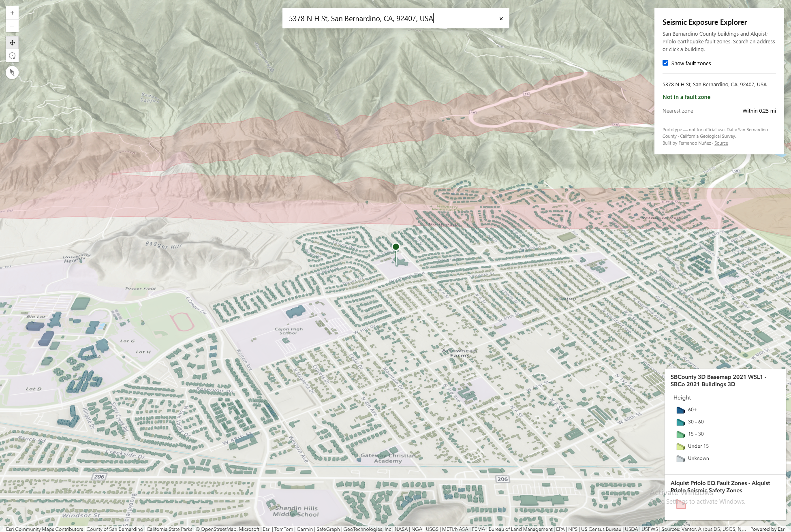

# Seismic Exposure Explorer

A 3D web app that answers one question: **is this building inside an earthquake fault zone?**

Search an address in San Bernardino County, or click any building, and the app runs a spatial query against California's Alquist-Priolo seismic hazard zones and tells you the answer.

**Live demo:** [https://seismic-exposure-explorer.vercel.app/](https://seismic-exposure-explorer.vercel.app/)

## Why I built it

I wanted to explore the ArcGIS Maps SDK for JavaScript by building something that answers a real question rather than just rendering a map. Earthquake fault zones are a genuine concern for homeowners here, and San Bernardino County publishes both the building footprints and the hazard zones as open data.

## Data

| Layer | Source | Notes |
|---|---|---|
| 3D building footprints | San Bernardino County | 584,000 buildings, cached scene layer |
| 2D building footprints | San Bernardino County | 830,000 polygons, used for spatial queries |
| Alquist-Priolo fault zones | California Geological Survey, via San Bernardino County | 245 polygons |
| Basemap, terrain, geocoding | Esri | |

## Stack

- Next.js (App Router) + TypeScript
- ArcGIS Maps SDK for JavaScript (`@arcgis/core`)
- CSS Modules
- Deployed on Vercel

## How it works

**3D rendering.** Buildings come from a cached 3D object scene layer rendered in a `SceneView`, coloured by height with a class-breaks renderer. Fault zones are polygons draped on the terrain.

**Point vs. polygon.** An address is genuinely a point, so address searches query the fault zones with that point. A *building* is not — a footprint can straddle a zone boundary. Clicking a building therefore fetches its real outline from the 2D footprints layer and tests the whole polygon with an intersects query, so a building partly inside a zone correctly reports as inside.

**"Nearest zone" without geometry math.** When a location isn't in a zone, the app runs distance queries at widening radii (¼, ½, 1, 2, 5, 10, 25 miles) and reports the first hit. This keeps the work server-side and avoids client-side projection and geodesic distance calculations for an approximate answer that only needs to be approximate.

**Search.** A custom input calling `suggestLocations` and `addressToLocations` directly, rather than the Search widget, so the UI is fully styleable. Includes browser geolocation with reverse geocoding for the address label.

**Loading state.** The overlay clears when the scene layer view actually stops updating (`layerView.updating`), not when the view is merely ready — so it reflects when buildings have really finished drawing.

## Limitations

* Prototype, not for official use. Authoritative fault zone determinations come from the California Geological Survey.
* Building data is from 2021 and won't include newer construction.
* "Nearest zone" is bucketed to the query radii above, not an exact distance.
* Geolocation requires HTTPS, so it works on the deployed site but not over a plain-HTTP local network address.

## Author
Built by Fernando Nunez
